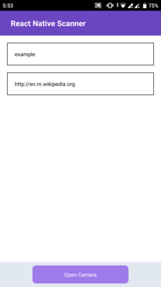
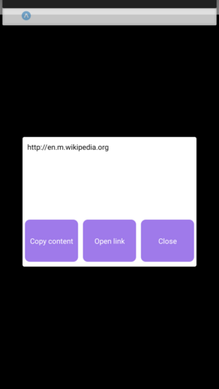
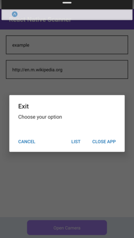

# React Native Scanner
> This is React Native scanner application powered by Expo API that provides the main function to decode and interact with the content.

---

## Table of contents
* [Screenshots](#screenshots)
* [Technologies](#technologies)
* [Setup](#setup)
* [Features](#features)
* [Credits](#credits)
* [Contact](#contact)

---

## Screenshots

<br/>

<br/>


---

## Technologies
* Expo - version 37.0.3
* React - version 16.9.0
* React Native - version 0.61
* TypeScript - version 3.8.3
* TailwindCSS - version 1.2.0

---

## Setup
Clone this repo to your desktop.

Run the command to install dependencies.
```
$ yarn install
```

Run the development server.
```
$ yarn start
```

---

## Features
* Scan QR code
* Display decoded content
* Copy decoded content
* Open link if decoded content is URL

---

## Credits
* Icons made by <a href="https://www.flaticon.com/authors/iconixar" title="iconixar">iconixar</a> from <a href="https://www.flaticon.com/" title="Flaticon"> www.flaticon.com</a>

---

## Contact
Created by [@anas.didi95](mailto:anas.didi95@gmail.com)
